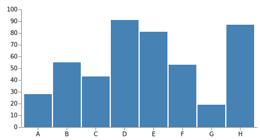
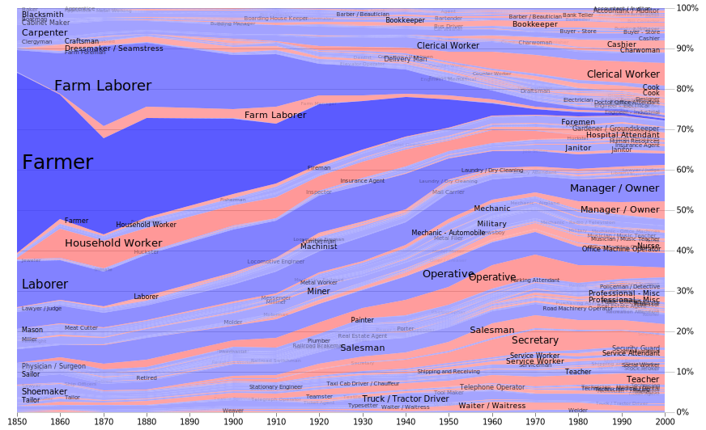

## GoVega

Render [Vega](https://vega.github.io/) charts, graphs, and maps in pure Go.

Using the amazing [Goja](https://github.com/dop251/goja) JavaScript engine we can directly render Vega SVGs in pure Go.

[](https://pkg.go.dev/github.com/gravwell/govega)

### Examples

This library is fully compatible with Vega 5 and can render all types of charts.




#### Usage

```
specBytes, err := ioutil.ReadFile(*vegaSpec)
if err != nil {
	log.Fatal("Failed to load spec file", *vegaSpec, err)
	return
}
var dataObj map[string]interface{}
if *data != `` {
	dataBytes, err := ioutil.ReadFile(*data)
	if err != nil {
		log.Fatal("Failed to load datafile")
	}
	if err := json.Unmarshal(dataBytes, &dataObj); err != nil {
		log.Fatal("Failed to parse datafile")
	}
}
vm, err := govega.New()
if err != nil {
	log.Fatal("Failed to build govega VM", err)
}
ctx := context.Background()
svg, err := vm.Render(specBytes, dataObj, ctx)
if err != nil {
	log.Fatalf("Failed to render %q %v\n", *vegaSpec, err)
}
```

### Caveats

Vega specs can reference data using a URL, however this library does not contain a JavaScript fetch implementation.
This means you need to populate a `map[string]interface{}` of the data items and hand it to the VM.

### A note about performance

Vega has the ability to transform data via embedded JavaScript and also render extremely complex visualizations, and while goja has pretty decent performance it is not as fast as V8 or other "native" JavaScript engines.  Be warned that some Vega specs can take a very long time to render (10s of seconds).

Here are some render times on a Core i7-1065G7 with Go 1.17.6.

| Example Spec | Render Time |
|--------------|-------------|
|`examples/bar-chart.vg.json` | 0.083s |
|`examples/grouped-bar-chart.vg.json` | 0.093s |
|`examples/u-district-cuisine/u-district-cuisine.vg.json` | 0.484s |
|`examples/job-voyager/job-voyager.vg.json` | 2.12s |
|`examples/county-unemployment/county-unemployment.vg.json` | 12.87s |

